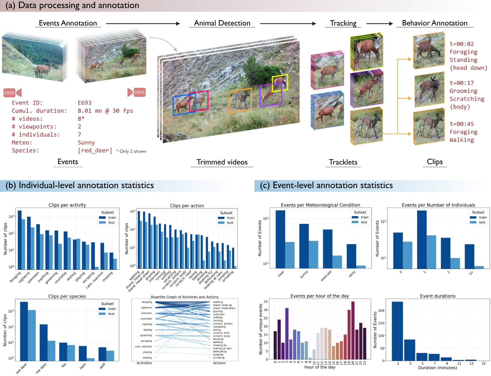

# MammAlps - A multi-view video behavior monitoring dataset of wild mammals in the Swiss Alps

<p align="center">
    
</p>

## Download the data
Data is available for download on [zenodo](https://doi.org/10.5281/zenodo.15040901).

## Dense annotations format

The dense annotations are provided in a JSON format, which contains metadata about the video and detailed frame-by-frame annotations.

### Structure overview

The JSON file is organized into two main sections:
1. **`info`**: Contains metadata about the video file.
2. **`frames`**: Contains frame-by-frame annotations, including detections and their attributes.

---

### `info` section

The `info` section provides metadata about the video file, including:
- **`site_id`**: Identifier for the site where the video was recorded [S1, S2, S3].
- **`cam_id`**: Identifier for the camera used to record the video [C1, C2, C3].
- **`event_id`**: Identifier for the ecological event captured in the video.
- **`file_id`**: Unique identifier for the video file.
- **`file_path`**: Path to the video file.
- **`num_frames`**: Total number of frames in the video.
- **`duration_s`**: Duration of the video in seconds.
- **`fps`**: Frames per second of the video.
- **`resolution`**: Resolution of the video (e.g., `1920x1080`).
- **`automatically_discarded`**: Boolean indicating whether the video was automatically discarded during preprocessing, meaning it does not contain any annotation. Some videos depicting an animal may have been automatically discared.
- **`attributes`**: Additional metadata, (e.g., meteorological conditions).

---

### `frames` section

The `frames` section contains a list of frames, each with its own annotations. Each frame includes:
- **`frame_id`**: The frame number (starting from 0).
- **`detections`**: A list of detected individuals in the frame. If no individuals are detected, this list is empty.

---

### `detections` in each frame

Each detection in a frame includes the following fields:
- **`track_id`**: Unique identifier for the tracked individual across frames.
- **`bbox`**: Bounding box coordinates for the detected individual, formatted as `[x_min, y_min, x_max, y_max]`.
- **`attributes`**: A dictionary of attributes describing the individual, including:
  - **`action`**: The action being performed by the individual (e.g., `standing_head_up`).
  - **`activity`**: The activity of the individual (e.g., `vigilance`).
  - **`action2`**: A secondary action (if applicable; e.g., `vocalizing`).
  - **`species`**: The species of the detected individual (e.g., `red_deer`).
- **`segment_id`**: Identifier for the segment within the individual track. A track can be separated in multiple segments if the tracked individual leaves the field of view and comes back.
- **`manually_corrected`**: Boolean indicating whether the track localization was manually corrected.

---

### Example

Below is an example of a JSON annotation file, which you can find [here](./resources/demo_annotations.json):

```json
{
  "info": {
    "site_id": "S1",
    "cam_id": "C1",
    "event_id": "E4",
    "file_id": "S1_C1_E4_V0016",
    "file_path": "S1/C1/S1_C1_E4_V0016.mp4",
    "num_frames": 615,
    "duration_s": 20.5,
    "fps": 30.0,
    "resolution": "1920x1080",
    "automatically_discarded": false,
    "attributes": {
      "meteo_conditions": "none"
    }
  },
  "frames": [
    {
      "frame_id": 0,
      "detections": [
        {
          "track_id": 1,
          "bbox": [
            0,
            346,
            400,
            1078
          ],
          "attributes": {
            "action": "walking",
            "action2": "none",
            "activity": "foraging",
            "species": "red_deer"
          },
          "segment_id": 1,
        }
      ]
    },
    ... # Detections for next frames
  ]
}
```
