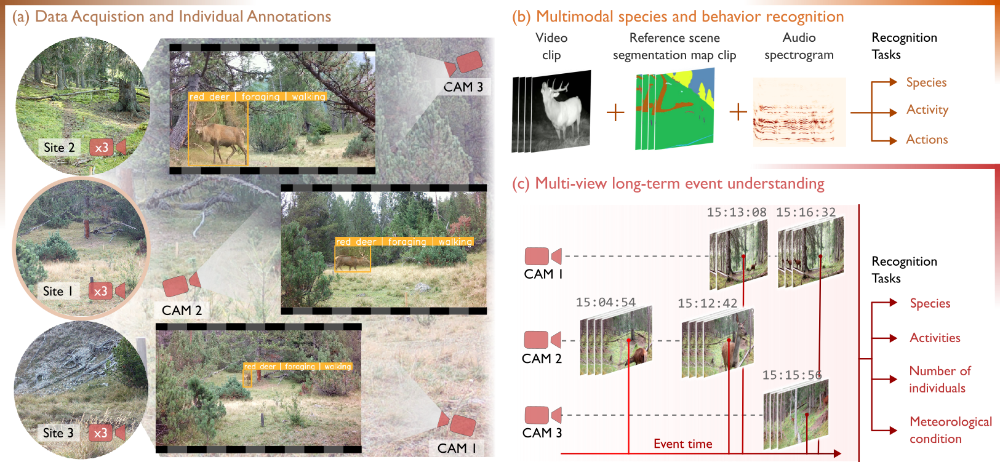

# MammAlps - A multi-view video behavior monitoring dataset of wild mammals in the Swiss Alps

<p align="center">
    
</p>

MammAlps is a multimodal and multi-view dataset of wildlife behavior monitoring. Nine camera-traps were placed in the Swiss National Park, from which we curated over 14 hours of video with audio, 2D segmentation maps and 8.5 hours of individual tracks densely labeled for species and behavior.  

Along with the data, we propose two different benchmarks:
- **Benchmark I - Multimodal species and behavior recognition**: Based on 6`135 single animal clips, we propose a hierarchical and multimodal animal behavior recognition benchmark using audio, video and reference scene segmentation maps as inputs.
- **Benchmark II - Multi-view Long-term event understanding**: a second ecology-oriented benchmark aiming at identifying activities, species, number of individuals and meteorological conditions from 397 multi-view and long-term ecological events, including false positive triggers.

## Download the data
Data is available for download on [zenodo](https://doi.org/10.5281/zenodo.15040901). 

## Installation
Instructions will be provided upon code release.

## Usage
Instructions will be provided upon code release.

## Citation
```bibtex
@article{gabeff2025mammalps,
      title={MammAlps: A multi-view video behavior monitoring dataset of wild mammals in the Swiss Alps},
      author={Valentin Gabeff and Haozhe Qi and Brendan Flaherty and Gencer Sumbül and Alexander Mathis and Devis Tuia},
      year={2025},
      journal={arXiv},
      doi={10.48550/arXiv.2503.18223},
}
```

## Acknowledgements
We thank members of the Mathis Group for Computational Neuroscience \& AI (EPFL) and of the Environmental Computational Science and Earth Observation Laboratory (EPFL) for their feedback and fieldwork efforts. We also thank members of the Swiss National Park monitoring team for their support and feedback. The project was approved by the Research Commission of the National Park.

## License
This code is released under the [MIT license](https://choosealicense.com/licenses/mit/)
